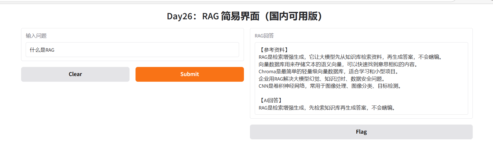

# RAG-Private-Knowledge-Bot


> 🔧 **基于检索增强生成 (RAG) 的企业级私有知识库对话系统**
> 
> 💡 项目目标：解决大模型“幻觉”问题，实现对本地私有文档的精准问答，可作为企业内部客服或教学辅助工具。

## ✨ 项目亮点
1.  **高可信度**：引入 **RAG 架构**，回答严格依据上传的文档，杜绝瞎编（Hallucination）。
2.  **轻量部署**：基于 **Chroma** 轻量级向量数据库，无需复杂的分布式环境，单机即可运行。
3.  **快速交互**：封装 **Gradio** 友好界面，开箱即用，提供类似 ChatGPT 的对话体验。
4.  **国产适配**：采用开源向量化模型，支持国内网络环境（HF Mirror）。

## 🔧 技术栈
*   **框架**：LangChain (LangChain Community)
*   **向量库**：Chroma (用于语义相似度检索)
*   **向量化模型**：all-MiniLM-L6-v2 (轻量高效)
*   **Web界面**：Gradio
*   **开发环境**：Python 3.9+, Conda

## 🚀 快速开始

### 1. 环境安装
```bash
pip install -r requirements.txt

2. 运行项目
bash
运行
python main.py
启动后，访问 http://127.0.0.1:7863 即可使用。
3. 功能演示
系统自动加载预设的知识库文档（RAG & CNN 原理）。
在输入框提问（例如："什么是 RAG？"）。
系统自动检索相关文档片段，并生成回答。
📷 运行截图

📖 项目细节
文档切分：使用 RecursiveCharacterTextSplitter 按语义分割文本。
语义检索：将文本转为向量存入 Chroma，检索时计算余弦相似度。
生成回答：检索结果作为上下文填入 Prompt，引导大模型生成答案。
🔜 未来计划
 接入本地大模型 (Qwen/Llama)
 支持 PDF/Word 批量上传
 增加知识库管理功能

